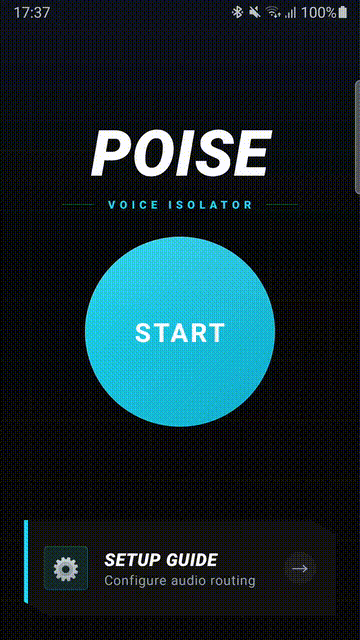

# Poise Android

A high-performance voice isolation app that uses machine learning denoising models to isolate speech in real-time for system-wide Android audio. Currently works only with samsung devices through the 'Separate app sound' feature.



## Features
- **ML Voice Isolation**: Real-time background noise suppression for clear audio.
- **Advanced Audio Routing**: Designed to work with "Separate App Sound" on Samsung devices.
- **Voice Activity Detection**: Will only run inference and process audio when it detects sound.

> **Note**: The app need casting permissions to access the audio stream and route it properly.

## Installation

Untill I officially publish on the Play Store, you can install the app from the [GitHub releases](https://github.com/chabandou/poise-android/releases).

## Getting Started

### Prerequisites
- Android SDK & JDK 17+
- Android Device (Samsung recommended for specific routing features)

### Build & Install
```bash
# Build the debug APK
./gradlew assembleDebug

# Install on connected device
adb install -r app/build/outputs/apk/debug/app-debug.apk
```
